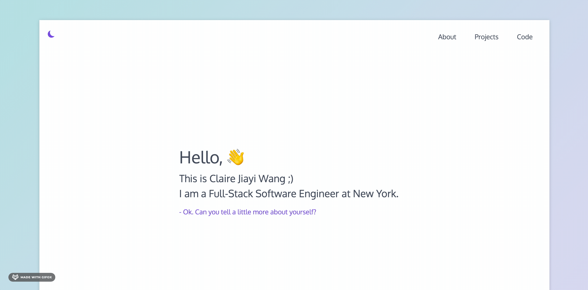
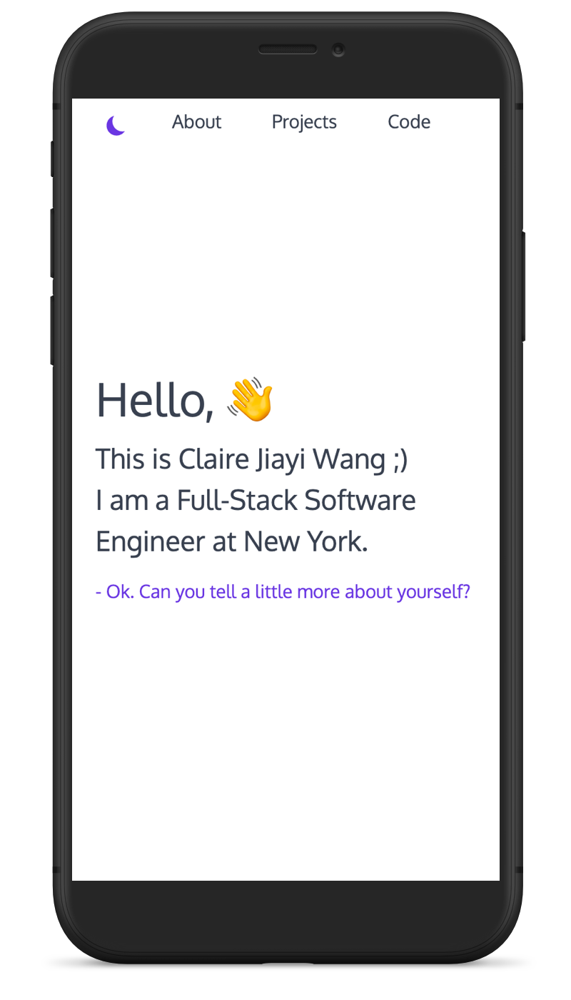

# portfolio  :star2:

## Description
This portfolio website showcases my past project examples in web development and instructional design. 
I developed this website with 
* HTML
* CSS
* Vanilla JavaScript. 
 

## Design Concepts  :art:
The design concept of this portfolio is minimalism. Except for containing only the most relevant information about myself, I included an animated gradient border, a dark and light mode SVG button, as well as a waving hand emoji to add some interactivity and fun to the website.   

 
 

## Mobile friendly  :iphone: 
The site is also responsive / mobile friendly.  
Try visit [it](http://www.jiayiwang.co) through you phone!   

 

## Credits
* If you are interested about the waving hand emoji :wave: animation, I referenced Jake Jarvis's [blog post](https://jarv.is/notes/css-waving-hand-emoji/).
* The :new_moon: / :sun_with_face: mode as well color scheme used on this website was largely inspired by Cole Townsend's [portfolio](https://twnsnd.co/) in 2018. 
* The human/machine dialogue style introduction was also inspired by Human Interface Designer [Yaron Schoen](http://yaronschoen.com/).

